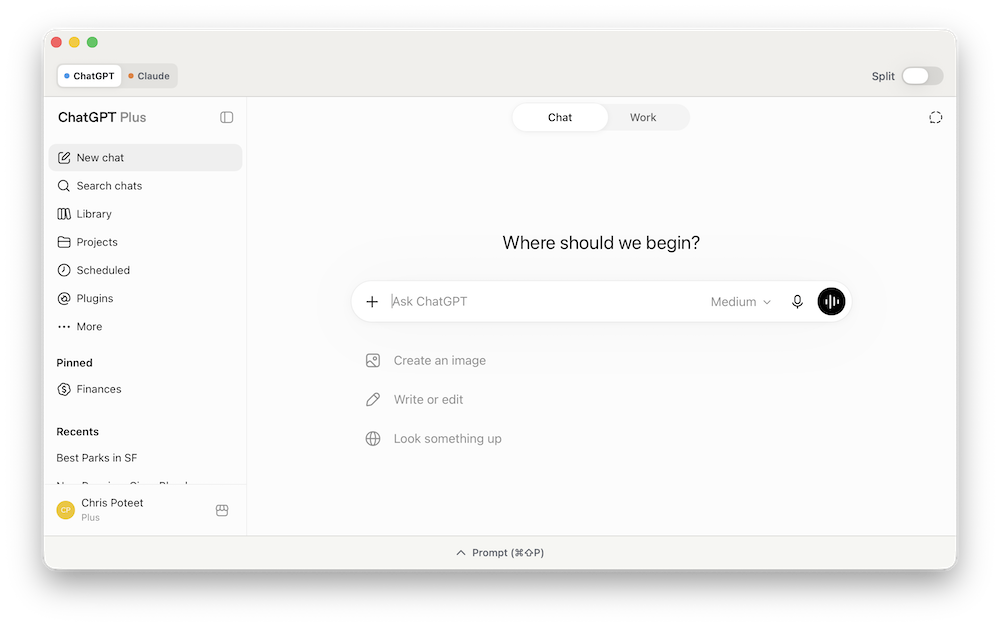
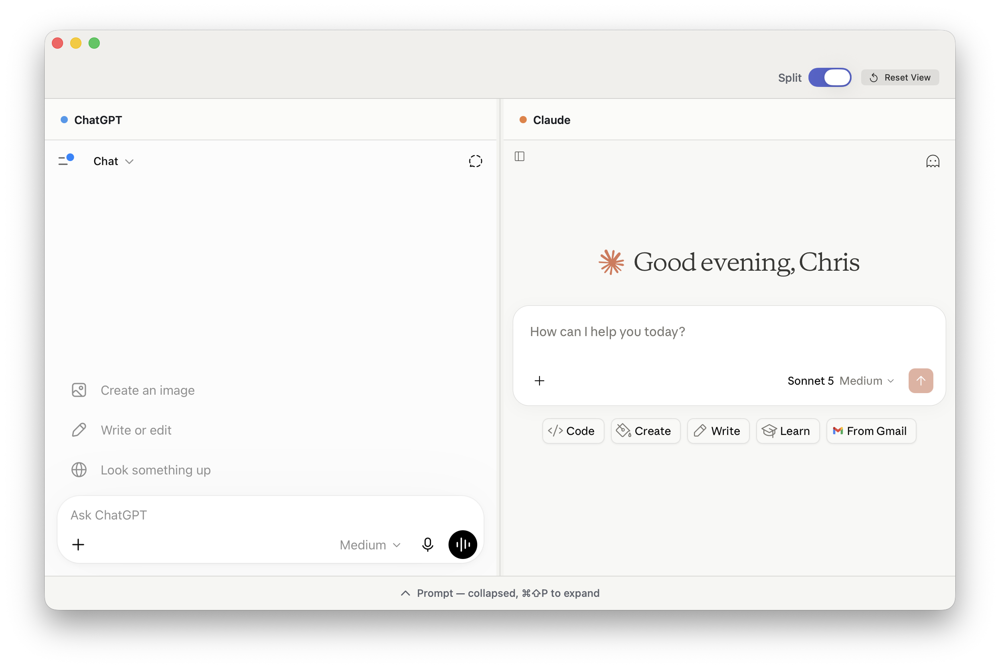

# Duet

Duet is a native macOS workspace for ChatGPT and Claude. It keeps each service in its familiar web interface while giving you a focused way to switch between them, compare them side by side, send one text prompt to both, or start a fresh conversation from anywhere on your Mac.

Both the ChatGPT and Claude Mac apps are bloated Electron apps that are unnecessary when chat is all that is desired, and it can be helpful to compare the output between AI providers.

## Features

- **ChatGPT and Claude in one app.** Choose either provider at launch, then switch between them without opening a separate browser window.
- **Side-by-side comparison.** Turn on Split to keep ChatGPT and Claude visible together; resize the divider or reset the panes to equal widths.
- **Quick Prompt from anywhere.** Press **Control–Option–Space**, or choose **Tools → Quick Prompt**, to send a prompt to a new ChatGPT conversation, a new Claude conversation, or both.
- **Shared prompt drawer.** Expand the native prompt bar to send plain-text prompts to the active provider or to both providers at once.
- **Your familiar AI workspaces.** Conversations, chat history, attachments, and provider-specific tools stay inside the official websites.
- **Persistent sign-in sessions.** Duet uses persistent WebKit website data so your sessions normally remain available after relaunching.
- **Configurable switching performance.** Keep Duet's lower-memory default, or enable **Keep both providers loaded** in Settings for faster switching.
- **Privacy-minded by design.** Sign in directly with each provider; Duet does not collect, store, or transmit your credentials.

## Install

Duet runs on Apple Silicon Macs with macOS 15 or later.

1. Download `Duet.zip` and double-click it to extract the `Duet` folder.
2. Drag `Duet.app` to your **Applications** folder.
3. Open Duet from Applications. macOS will notify you that the app is unsigned and cannot be verified.
4. Close that notification, open **System Settings** → **Privacy & Security**, then scroll to the **Security** section.
5. Click **Open Anyway** next to the Duet warning, then confirm by clicking **Open**.

Reminder that you use this application at your own risk.

## Use Duet

1. Launch Duet and choose **ChatGPT**, **Claude**, or **Both**.
2. Sign in directly in the embedded provider page. Complete any passkey, two-factor authentication, or verification steps there.
3. In single view, use the provider picker to switch services. Toggle **Split** any time to view both together.
4. For faster switching at the cost of additional memory, open **Duet → Settings** and enable **Keep both providers loaded**.
5. Expand the **Prompt** drawer when you want to enter a text-only prompt. Send it to the active provider or choose **Send to Both** to submit the same prompt to ChatGPT and Claude.
6. From any app, press **Control–Option–Space** to open **Quick Prompt**. Choose **ChatGPT**, **Claude**, or **Both**; Duet brings its workspace forward and starts a fresh conversation with each selected provider. You can also open Quick Prompt from **Tools → Quick Prompt** while Duet is active.
7. Read and continue each conversation inside its provider pane. Duet does not merge or scrape provider responses.

## License

Duet is available under the **Duet License 1.0**. It permits personal and internal business use, as well as modification and free redistribution. You may not sell, monetize, commercially host, or provide Duet or derivative works as part of a paid product or service. Free distributions must retain the license and attribution, identify modifications, and use the same license. The software is provided without warranty.

Read the complete [LICENSE.md](LICENSE.md) file in this repository. A copy is also included in every `Duet.zip` distribution.
