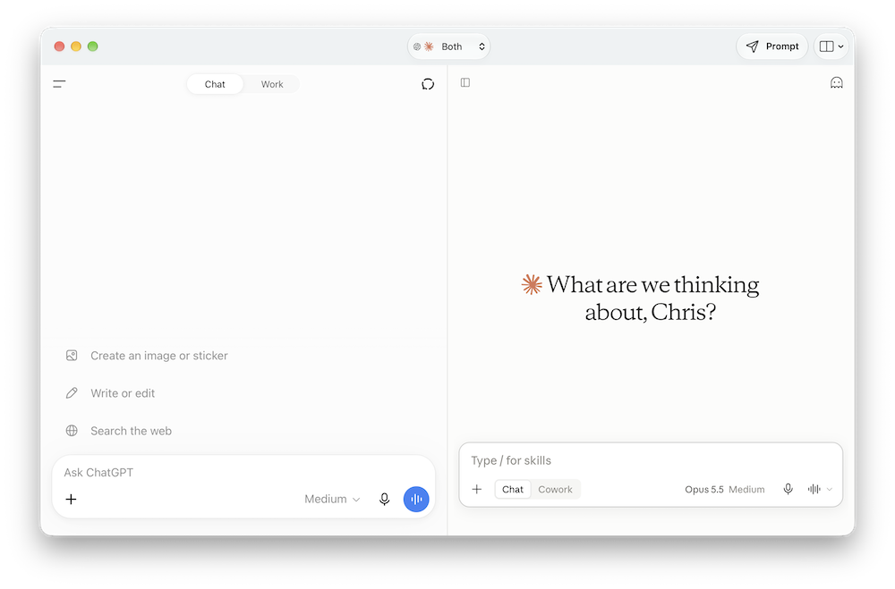

# Duet

Duet is a native macOS workspace for ChatGPT and Claude. It keeps each service in its familiar web interface while giving you a focused way to switch between them, compare them side by side, send one text prompt to both, or start a fresh conversation from anywhere on your Mac.



[See the single-provider view](Screenshots/single-view.png).

## Features

- **ChatGPT and Claude in one app.** Choose either provider at launch, then switch between them without opening a separate browser window.
- **Side-by-side comparison.** Choose **Both** in the workspace toolbar to keep ChatGPT and Claude visible together; resize the native divider or use **Layout → Equal Widths**.
- **Quick Prompt from anywhere.** Press **Control–Option–Space**, or choose **Tools → Quick Prompt**, to send a prompt to a new ChatGPT conversation, a new Claude conversation, or both.
- **Your preferred startup view.** Keep the destination chooser, open directly to ChatGPT, Claude, or Both, or return to the workspace you used last. Duet also remembers your workspace size between launches.
- **Shared prompt drawer.** Open **Prompt** in the workspace toolbar to send plain-text prompts to the active provider or to both providers at once.
- **Your familiar AI workspaces.** Conversations, chat history, attachments, and provider-specific tools stay inside the official websites.
- **Native file transfers.** Upload attachments with the standard file picker and save provider-generated files with a macOS save dialog.
- **Native permission handling.** Use provider microphone, camera, and precise-location features through macOS permission prompts for trusted ChatGPT and Claude pages.
- **Lightweight update notices.** Once per launch, Duet checks the latest public GitHub Release and shows a dismissible banner when a newer version is available. It never downloads or installs updates automatically.
- **Persistent sign-in sessions.** Duet uses persistent WebKit website data so your sessions normally remain available after relaunching.
- **Configurable switching performance.** Keep Duet's lower-memory default, or enable **Keep both providers loaded** in Settings for faster switching.
- **Privacy-minded by design.** Sign in directly with each provider; Duet does not collect, store, or transmit your credentials.

## Install

Duet runs on Apple Silicon Macs with macOS 15 or later.

1. Download `Duet.zip` from the [latest Duet release](https://github.com/cpoteet/Duet/releases/latest) and double-click it to extract the archive.
2. Drag `Duet.app` to your **Applications** folder.
3. Open Duet from Applications. A notarized release may show a standard first-open confirmation. The currently published v1.6.0 archive predates Developer ID notarization; if macOS says it cannot verify Duet, open **System Settings** → **Privacy & Security**, choose **Open Anyway**, and confirm.

Reminder that you use this application at your own risk.

## Use Duet

1. Launch Duet and choose **ChatGPT**, **Claude**, or **Both**. In Settings, you can instead choose a destination Duet should open automatically on future launches.
2. Sign in directly in the embedded provider page. Complete any passkey, two-factor authentication, or verification steps there.
3. When you first use provider dictation or audio chat, allow Duet to access the microphone in the macOS permission prompt.
4. When a provider feature requests your precise location, choose whether to allow Duet's macOS location request. Duet shares it only with trusted ChatGPT and Claude pages that request it.
5. Use the workspace picker in the toolbar to show **ChatGPT**, **Claude**, or **Both**. The **Layout** menu also switches between single and split view.
6. For faster switching at the cost of additional memory, open **Duet → Settings** and enable **Keep both providers loaded**.
7. Open **Prompt** in the toolbar, or press **Command–Shift–P**, when you want to enter a text-only prompt. Send it to the active provider or choose **Send to Both** to submit the same prompt to ChatGPT and Claude. Close the drawer when you are finished.
8. From any app, press **Control–Option–Space** to open **Quick Prompt**. Choose **ChatGPT**, **Claude**, or **Both**; Duet brings its workspace forward and starts a fresh conversation with each selected provider. You can also open Quick Prompt from **Tools → Quick Prompt** while Duet is active.
9. Read and continue each conversation inside its provider pane. Duet does not merge or scrape provider responses.

## Build and release

`./build.sh` builds and launches a local copy. To sign local builds with your Apple-issued certificate, create a Developer ID Application certificate in your Apple Developer account, install it with its private key in your login keychain, and put its full name (for example, `Developer ID Application: Your Name (TEAMID)`) in the ignored `.duet-signing-identity` file. Check the installed name with `security find-identity -p codesigning -v`. Developer ID local builds use the release hardened runtime and capabilities, but do not wait for notarization.

For releases, save notarization credentials once in your keychain:

```sh
xcrun notarytool store-credentials duet-notary --apple-id YOUR_APPLE_ID --team-id YOUR_TEAM_ID
```

Replace `YOUR_APPLE_ID` with the email address of the Apple Account in your developer team and `YOUR_TEAM_ID` with that team's ID. At the secure prompt, enter an app-specific password generated for that same Apple Account, not its normal sign-in password. Then run `./test.sh` and `./release.sh`. The release command builds without launching Duet, signs with hardened runtime, submits a temporary archive for notarization, staples the accepted ticket to `dist/Duet.app`, and packages the signed app with `LICENSE.md` in `Duet.zip`. It verifies the signature, ticket, and Gatekeeper assessment before finishing. Do not publish the archive until you have smoke-tested the extracted app, preferably on another Mac.

Keep the certificate private key and notarization credentials out of the repository. A new release build needs a new notarization submission. The Developer ID certificate must be installed before `./release.sh` can run.

## License

Duet is available under the **Duet License 1.0**. It permits personal and internal business use, as well as modification and free redistribution. You may not sell, monetize, commercially host, or provide Duet or derivative works as part of a paid product or service. Free distributions must retain the license and attribution, identify modifications, and use the same license. The software is provided without warranty.

Read the complete [LICENSE.md](LICENSE.md) file in this repository. A copy is also included in every `Duet.zip` distribution.
