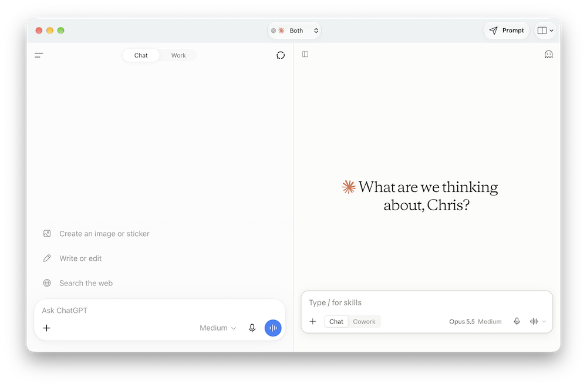

# Duet

Duet is a native macOS workspace for ChatGPT and Claude. It keeps each service in its familiar web interface while giving you a focused way to switch between them, compare them side by side, send one text prompt to both, or start a fresh conversation from anywhere on your Mac.

[See the single-provider view](Screenshots/single-view.png).

## Features

- **ChatGPT and Claude in one app.** Choose either provider at launch, then switch between them without opening a separate browser window.
- **Side-by-side comparison.** Choose **Both** in the workspace toolbar to keep ChatGPT and Claude visible together; resize the native divider or use **Layout → Equal Widths**.
- **Quick Prompt from anywhere.** Press **Control–Option–Space**, or choose **Tools → Quick Prompt**, to send a prompt to a new ChatGPT conversation, a new Claude conversation, or both.
- **Your preferred startup view.** Keep the destination chooser, open directly to ChatGPT, Claude, or Both, or return to the workspace you used last. Duet also remembers your workspace size between launches.
- **Shared prompt drawer.** Open **Prompt** in the workspace toolbar to send plain-text prompts to the active provider or to both providers at once.
- **Your familiar AI workspaces.** Conversations, chat history, attachments, and provider-specific tools stay inside the official websites.
- **Native file transfers.** Upload attachments with the standard file picker and save provider-generated files with a macOS save dialog.
- **Native permission handling.** Use provider microphone, camera, and precise-location features through macOS permission prompts for trusted ChatGPT and Claude pages.
- **Lightweight update notices.** Once per launch, Duet checks the latest public GitHub Release and shows a dismissible banner when a newer version is available. It never downloads or installs updates automatically.
- **Persistent sign-in sessions.** Duet uses persistent WebKit website data so your sessions normally remain available after relaunching.
- **Configurable switching performance.** Keep Duet's lower-memory default, or enable **Keep both providers loaded** in Settings for faster switching.
- **Privacy-minded by design.** Sign in directly with each provider; Duet does not collect, store, or transmit your credentials.

## Install

Duet runs on Apple Silicon Macs with macOS 15 or later.

1. Download `Duet.zip` from the [latest Duet release](https://github.com/cpoteet/Duet/releases/latest) and double-click it to extract the archive.
2. Drag `Duet.app` to your **Applications** folder.
3. Open Duet from Applications. macOS may show a standard first-open confirmation.

Reminder that you use this application at your own risk.

## Use Duet

1. Launch Duet and choose **ChatGPT**, **Claude**, or **Both**. In Settings, you can instead choose a destination Duet should open automatically on future launches.
2. Sign in directly in the embedded provider page. Complete any passkey, two-factor authentication, or verification steps there.
3. When you first use provider dictation or audio chat, allow Duet to access the microphone in the macOS permission prompt. The same applies to requests for your location.
4. Use the workspace picker in the toolbar to show **ChatGPT**, **Claude**, or **Both**. The **Layout** menu also switches between single and split view.
5. For faster switching at the cost of additional memory, open **Duet → Settings** and enable **Keep both providers loaded**.
6. Open **Prompt** in the toolbar, or press **Command–Shift–P**, when you want to enter a text-only prompt. Send it to the active provider or choose **Send to Both** to submit the same prompt to ChatGPT and Claude. Close the drawer when you are finished.
7. From any app, press **Control–Option–Space** to open **Quick Prompt**. Choose **ChatGPT**, **Claude**, or **Both**; Duet brings its workspace forward and starts a fresh conversation with each selected provider. You can also open Quick Prompt from **Tools → Quick Prompt** while Duet is active.
8. Read and continue each conversation inside its provider pane. Duet does not merge or scrape provider responses.

## Website

The public landing page lives in `site/`, with HTML in `index.html`, CSS in `styles.css`, JavaScript in `script.js`, and local images and fonts in `assets/`. It requires no build step or package dependencies.

Preview it locally with `python3 -m http.server 8000 --directory site`, then open `http://localhost:8000`.

The [site deployment workflow](.github/workflows/deploy-site.yml) publishes only `site/` to GitHub Pages when the site or workflow changes on `main`. It can also be run manually from GitHub Actions. This repository uses **GitHub Actions** as its Pages publishing source; for a fork, select that source in **Settings → Pages** before the first deployment. The site's address is `https://cpoteet.github.io/Duet/`.

## License

Duet is available under the **Duet License**. You may use it for personal or paid work, modify and build it for yourself or your organization, and fork the repository on GitHub as GitHub's Terms of Service allow. You may not sell Duet or derivative works, charge to host, install, or support them, or redistribute them outside the license's internal-use and GitHub-forking permissions. ChatGPT and Claude remain subject to their providers' terms. The software is provided without warranty.

Read the complete [LICENSE.md](LICENSE.md) file in this repository. A copy is also included in every `Duet.zip` distribution.
